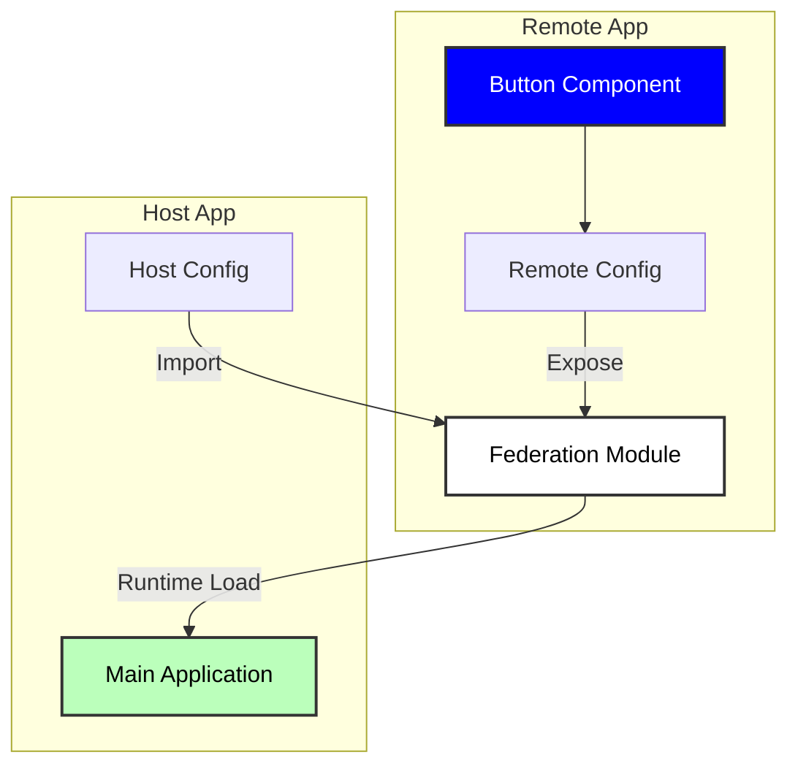

# 🔗 Micro-frontend with Module Federation

## 📖 Overview

As modern web applications grow in complexity, traditional monolithic frontends become challenging to maintain and scale. This simplified project demonstrates a practical implementation of Micro-frontend architecture using Vite and Module Federation.

### 🚧 Frontend Scaling Challenges

Modern frontend applications face several scaling challenges:

- **Team Autonomy**: Multiple teams working on the same codebase can lead to coordination overhead and deployment bottlenecks
- **Codebase Complexity**: As applications grow, the codebase becomes harder to maintain and understand
- **Technology Evolution**: Difficulty in adopting new technologies or upgrading existing ones without affecting the entire application

### ✨ How Micro-frontends Address These Challenges

1. **Independent Deployment**: Teams can deploy their features independently without coordinating with other teams
2. **Technology Flexibility**: Each micro-frontend can use different frameworks or versions, enabling gradual upgrades
3. **Simplified Maintenance**: Smaller, focused codebases are easier to maintain and test

### 🔌 Module Federation

Module Federation is a powerful feature that enables:

- Runtime sharing of components and modules between applications
- Lazy loading of remote modules for better performance
- Shared dependencies management to avoid duplicate code loading

## 🏗️ Build Flow

The following diagram illustrates how Module Federation enables component sharing between the remote and host applications:



### 🛠️ Build Process

1. **Remote Application**

   - Components are developed independently
   - Vite builds and exposes components via Module Federation
   - Components are packaged with their dependencies

2. **Host Application**

   - Configures remote module entry points
   - Dynamically imports remote components at runtime
   - Manages shared dependencies to avoid duplicates

3. **Runtime Flow**
   - Host requests remote component
   - Module Federation loads the component on demand
   - Component renders in the host application

## 📦 Dependencies

This project relies on the following core dependencies:

### 🛠️ Setup and Usage

1. **Install Dependencies**

   ```bash
   # Install pnpm if you haven't already
   npm install -g pnpm

   # Install dependencies in both remote and host applications
   cd react-mfe
   pnpm install

   cd ../react-mfe-host
   pnpm install
   ```

2. **Start the Applications**

   ```bash
   # First, build and start the remote app (react-mfe)
   cd react-mfe
   pnpm build
   pnpm preview     # Serves the built app on port 5001

   # In a new terminal, start the host app (react-mfe-host)
   cd react-mfe-host
   pnpm dev        # Starts the development server on port 5173
   ```

3. **Access the Application**
   - Remote component preview: [http://localhost:5001](http://localhost:5001)
   - Host application: [http://localhost:5173](http://localhost:5173)

> **Note**: The remote app must be running before starting the host app, as the host depends on the remote components being available.

### 👩‍💻 Development

For development mode, you can run both applications in separate terminals:

```bash
# Terminal 1 - Remote app
cd react-mfe
pnpm dev    # Starts on port 5001

# Terminal 2 - Host app
cd react-mfe-host
pnpm dev    # Starts on port 5173
```

## ✅ TODO

- [ ] Vue Remote Component configure with Vite federation & integration with React host
- [ ] Svelte Remote Component configure with Vite federation & integration with React host

### 📦 Build Tools & Module Federation

- [Vite](https://vitejs.dev/) - Next generation frontend tooling for modern web development
- [@originjs/vite-plugin-federation](https://github.com/originjs/vite-plugin-federation) - Module Federation plugin for Vite, enabling component sharing between applications
